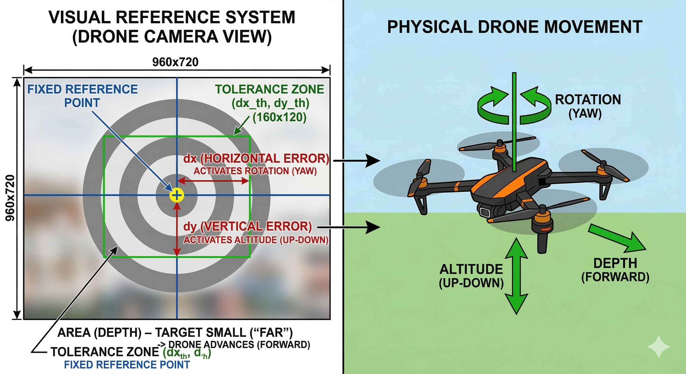

# Módulo de Seguimiento de Objetos con YOLO y Dron Tello

Este directorio contiene la lógica para el control autónomo de un dron DJI Tello que le permite identificar y seguir objetivos en tiempo real utilizando modelos de visión por computador (YOLO).

## Archivos Principales

### 1. `main.py`
Es el script principal y punto de entrada de la aplicación. Orquesta la conexión con el dron y el bucle principal de procesamiento de video. Sus características principales son:

- **Conexión y Video**: Inicializa el dron Tello, configura el stream de video a 720p 30 FPS y gestiona su despegue y aterrizaje.
- **Seguridad (KeepAlive)**: Implementa un hilo secundario que envía constantemente comandos vacíos para evitar que el dron aterrice automáticamente debido a tiempos de inactividad mientras no está siguiendo comandos.
- **Bucle de Inferencia**: Envía los fotogramas capturados al tracker y gestiona cuándo invocar al controlador de vuelo basándose en el "Target ID" seleccionado.
- **Exportación de Datos**: Usa el gestor JSON para guardar datos del fotograma y detecciones iteración a iteración.
- **Controles básicos de Teclado (Live UI)**:
  - `0`-`9`: Seleccionar el ID del frame/objetivo a seguir (`0` para deseleccionar y detener movimiento).
  - `Espacio` (` `): Pausar o reanudar el vuelo.
  - `b`: Mostrar u ocultar la guía de vuelo visual en pantalla.
  - `p`: Tomar y guardar una fotografía limpia de la cámara actual.
  - `ESC`: Desconectar, aterrizar el dron y salir.

### 2. `tracking.py`
Contiene la lógica pesada organizada en formato de clases. Su función es separar el control puro, la inferencia y el guardado de datos del script principal. Contiene 3 clases fundamentales:

- **`YOLOTracker`**: 
  - Inicializa y gestiona el modelo YOLO. 
  - Procesa cada frame invocando a `model.track()` para mantener los IDs estables entre fotogramas e ignorar ruido gracias al umbral de confianza.
  
- **`TrackingJSON`**: 
  - Permite codificar los fotogramas del dron en estático (Base64 JPEG).
  - Genera archivos JSON (`deteccion_*.json`) que empaquetan las posiciones exactas de todas las detecciones (x1, y1, x2, y2), el ID, la clase inferida y la propia imagen, funcionando a modo de datalogger.

- **`FlightController`**: 
  - Actúa como el cerebro de navegación y pilotaje.
  - Evalúa la posición (Centroide desplazado) y el tamaño (Área) del "Bounding Box" del objetivo.
  - Computa la matemática para mantener el objetivo en el rectángulo de "Tolerancia" en el centro de la pantalla. Controla proporcionalmente las velocidades de guiñada (YAW), altitud, y profundidad utilizando zonas de tolerancia para evitar movimientos bruscos del dron o un "latigazo".
  - Proporciona las funciones de dibujado (UX visual) para graficar crucetas y mostrar estados en pantalla.
